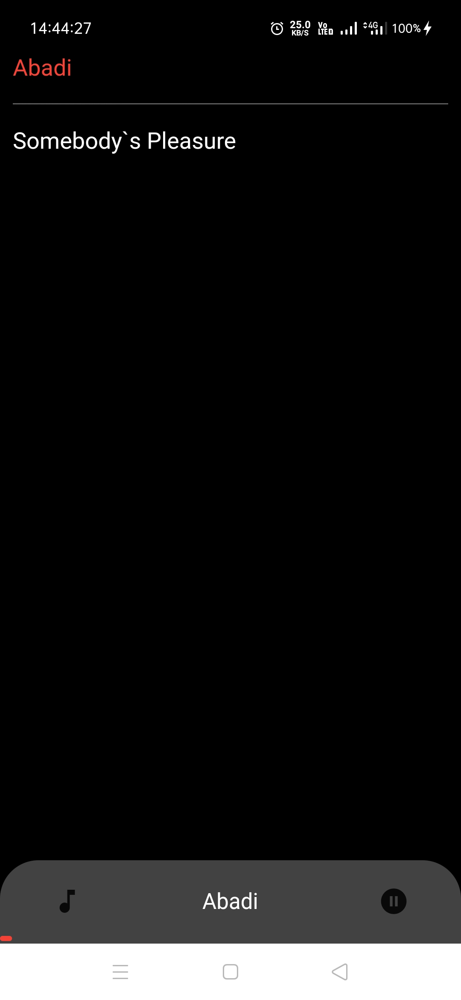
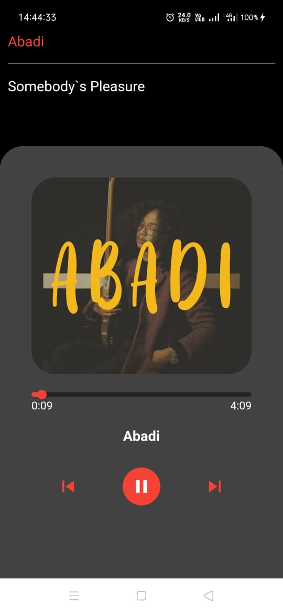
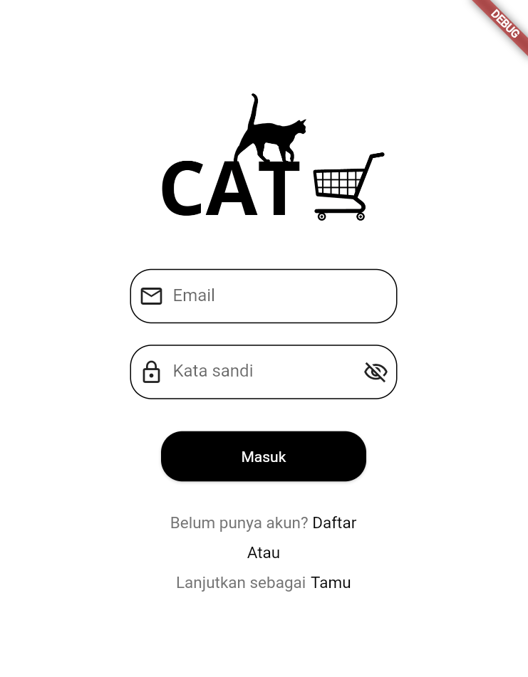
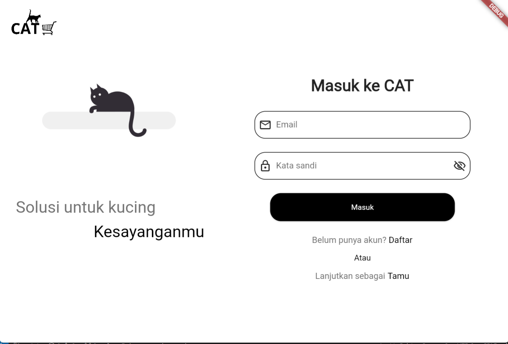
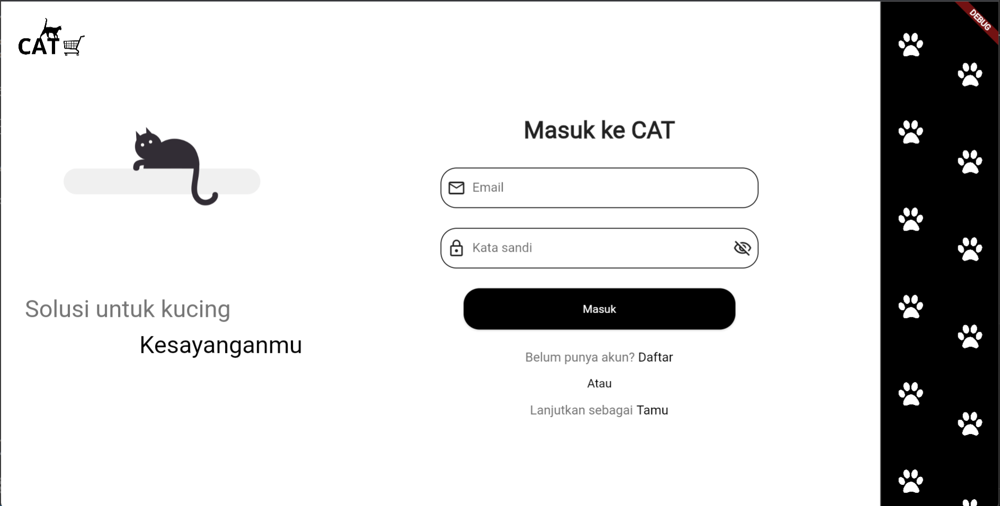

# Portofolio

Catatan: Dibawah ini berisi deskripsi singkat aplikasi serta peran atau tujuan saya dalam pembuatan aplikasi. Untuk detail lebih lanjut seperti demo bisa dilihat pada link github/playstore/appstore yang tersedia.

## Ahlul Quran
- Aplikasi Al-Quran dengan banyak fitur tambahan. Seperti hafalan dengan banyak metode hafalan berbeda, target membaca harian, riwayat target membaca dan hafalan dalam bentuk chart/grafik, serta export riwayat hafalan ke dalam file excel.
- Dalam aplikasi ini saya membantu mengembangkan fitur riwayat hafalan dan export hafalan.

   

- [Link Playstore](https://play.google.com/store/apps/details?id=com.ahlulquran&pcampaignid=web_share)
- [Link AppS tore](https://apps.apple.com/id/app/ahlul-quran-read-memorize/id1644631840)

## Music Player
- Aplikasi pemutar musik sederhana.
- Aplikasi dibuat untuk mempelajari state management bloc, arsitektur bloc, dan pemutar audio.

 

- [Link github](https://github.com/AryaRestaBayu/Music-Player.git)

## Cat Cart
- Aplikasi e-commerce single vendor yang menjual kebutuhan-kebutuhan kucing. Di buat untuk 3 ukuran layar.
- Aplikasi dibuat untuk submission dicoding dan mempelajari membuat layout adaptif untuk beberapa ukuran layar.

  

- [Link github](https://github.com/AryaRestaBayu/Cat-Cart)

## AniGoing
- Aplikasi untuk menampilkan daftar anime yang sedang berlangsung dan yang akan datang. Memuat trailer, genre, sinopsis, dll. Terintegrasi dengan firebase untuk autentikasi dan menyimpan daftar anime.
- Aplikasi dibuat untuk mempelajari state management getx, arsitektur mvc, sign in google, consume api server (publik), serta pemutar video.

  

- [Link github](https://github.com/AryaRestaBayu/anigoing.git)
- [More screenshot](./anigoing/) 

## Cash Flow
- Aplikasi untuk tracking cash flow. Dengan fitur autentikasi dengan laravel sanctum dan crud dengan laravel api.
- Aplikasi dibuat untuk mempelajari getx dan consume lokal api.

  

- [Link github](https://github.com/AryaRestaBayu/cash_flow.git)
- [More screenshot](./cash%20flow/)

## Londri
- Aplikasi laundry dengan multi role (user, kasir, owner, admin). Memiliki fitur autentikasi, membuat pesanan laundry, track status pesanan, export detail kedalam pdf, dll. Terintegrasi dengan firebase untuk autentikasi dan data pesanan.
- Aplikasi ini dibuat untuk menyelesaikan uji kompetensi sebagai syarat kelulusan sekolah.

  

- [Link github](https://github.com/AryaRestaBayu/Londri.git)
- [More screenshot](./londri/)

## Pregusta
- Aplikasi absensi dengan menyertakan foto. Aplikasi multi role (user dan admin). Memiliki fitur absen per tanggal, notifikasi pengingat absen, mengganti foto profile, dll. Terintegrasi dengan firebase untuk menyimpan data.
- Aplikasi dibuat untuk menyelesaikan tugas sekolah serta memplejari firebase dan pengambil gambar.

  

- [Link github](https://github.com/AryaRestaBayu/pregusta.git)
- [More screenshot](./pregusta/)
