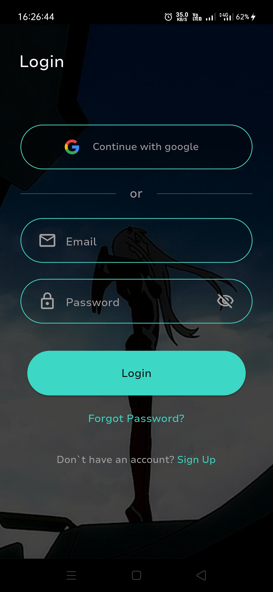
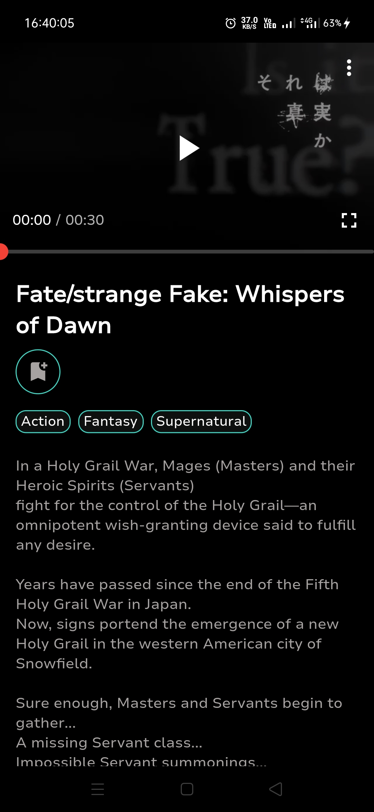
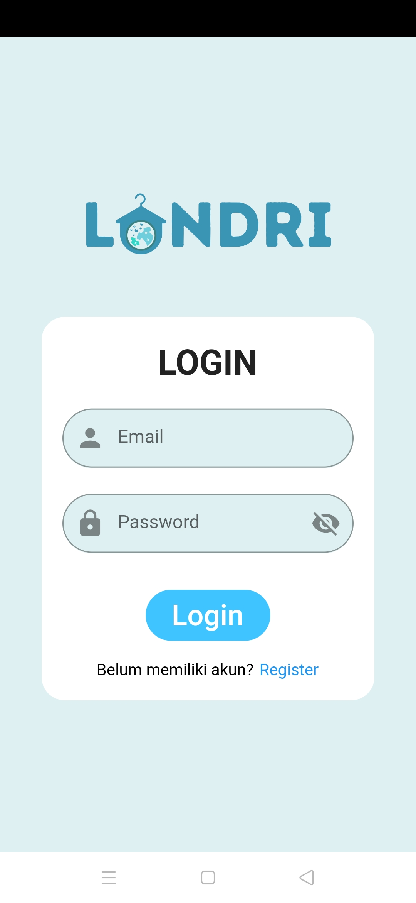
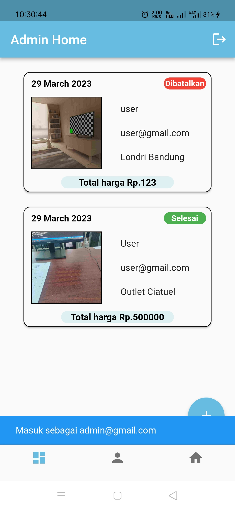
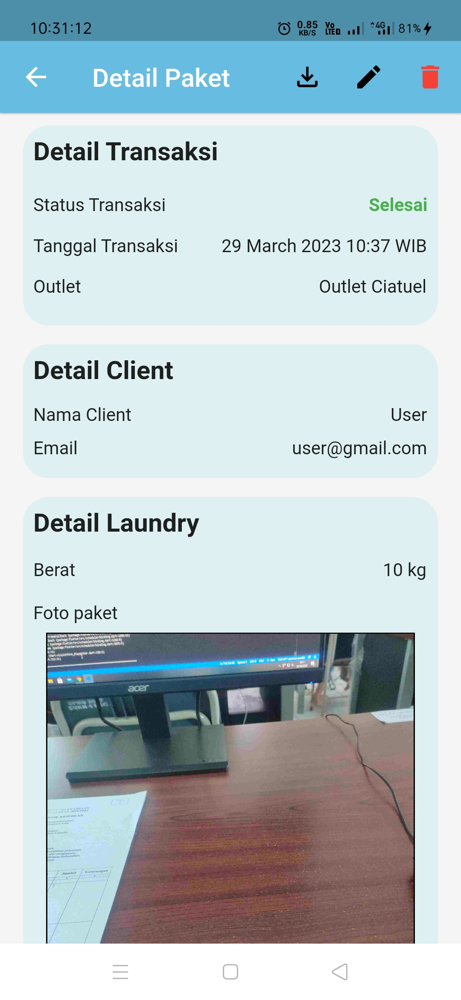
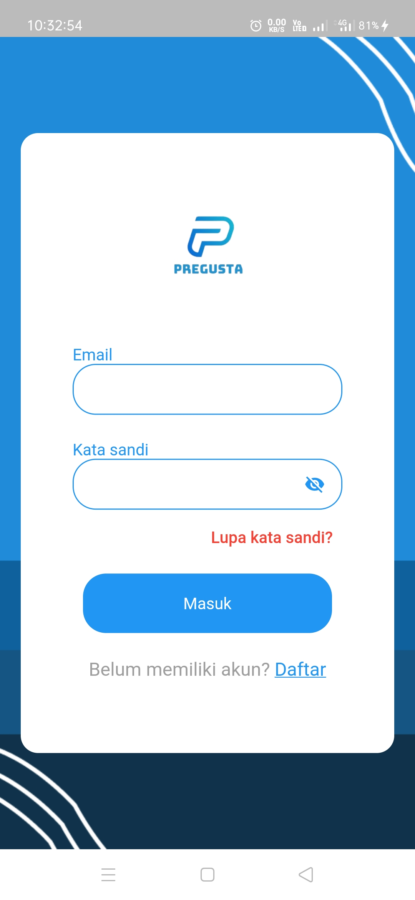
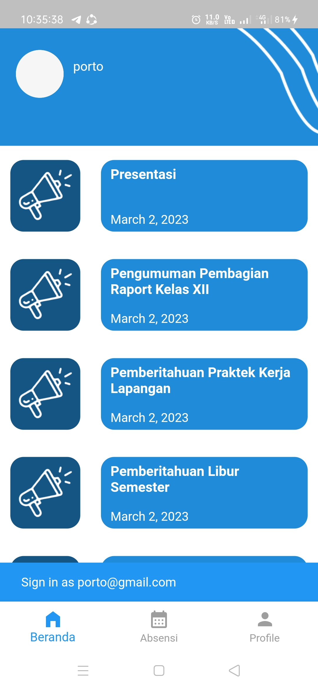
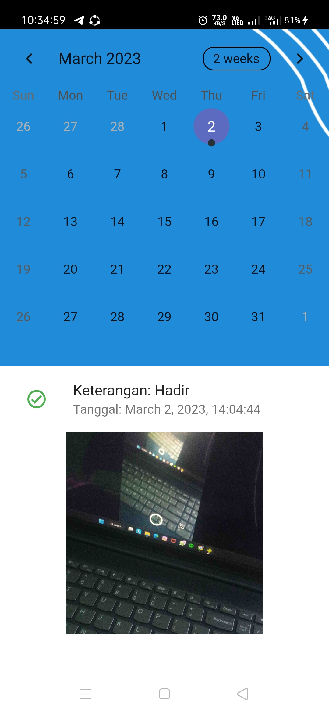

# Portofolio

## Ahlul Quran
- A Quran application that has several features to increase productivity as a Muslim. Such as target ayah to read, memorize surah, and export data to excel. 

   

- [Link Playstore](https://play.google.com/store/apps/details?id=com.ahlulquran&pcampaignid=web_share)

## AniGoing
- An application to provide anime ongoing and upcoming list.

  

- [Link github](https://github.com/AryaRestaBayu/anigoing.git)
- [More screenshot](./anigoing/) 

## Cash Flow
- An application to tracking cash flow.

  

- [Link github](https://github.com/AryaRestaBayu/cash_flow.git)
- [More screenshot](./cash%20flow/)

## Londri
- A laundry application. Has some features such as add laundry, export detail laundry to pdf, and add outlet.

  

- [Link github](https://github.com/AryaRestaBayu/Londri.git)
- [More screenshot](./londri/)

## Pregusta
- An application for an organization. Has some features such as attendance and announcement.

  

- [Link github](https://github.com/AryaRestaBayu/pregusta.git)
- [More screenshot](./pregusta/)
